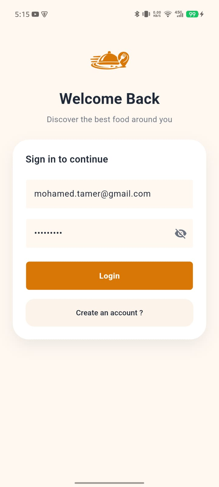
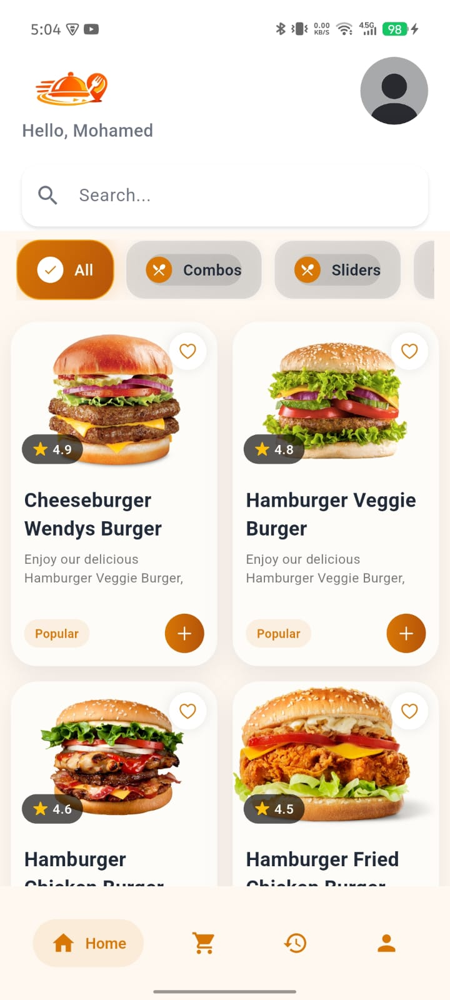
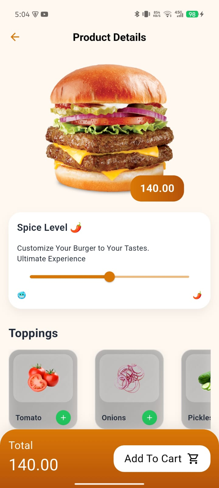
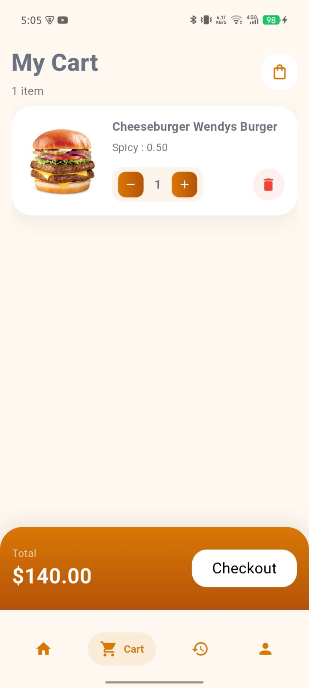
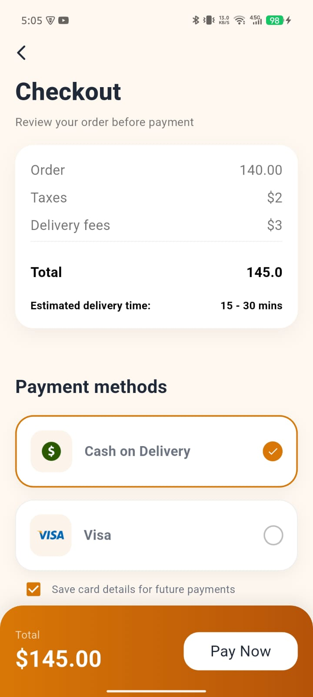
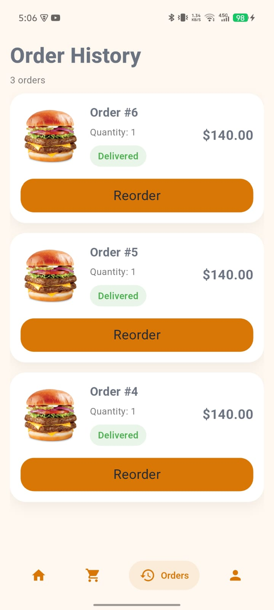
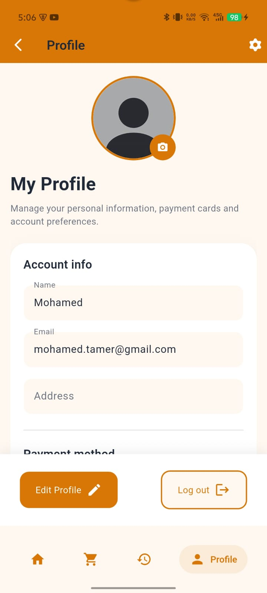

# 🍔 QuickBite - Food Delivery App

A modern food delivery mobile application built with Flutter, designed to provide a smooth and intuitive food ordering experience. The application allows users to browse products, search for meals, manage their cart, place orders, and track their order history through a clean and responsive interface.

## 📱 Overview

QuickBite is a Flutter-based food delivery application developed to demonstrate mobile development best practices, including API integration, state management, authentication workflows, and scalable project structure.

This project was built as a portfolio project to strengthen Flutter development skills and showcase the ability to create production-style mobile applications.

---

## ✨ Features

### Authentication

- User Login
- User Registration
- Auto Login
- Session Persistence using Shared Preferences

### Product Management

- Browse Products
- Product Details
- Search Functionality

### Shopping Experience

- Add to Cart
- Update Cart Items
- Checkout Flow

### Orders

- Place Orders
- View Order History

### User Profile

- Profile Management
- Account Information Display

### Error Handling

- API Error Handling
- User-Friendly Error Messages
- Network Failure Management

---

## 🖼️ Screenshots

<p align="center">
  
  
  
</p>

<p align="center">
  
  
  
</p>

<p align="center">
  
  
</p>

---

## 🛠️ Tech Stack

### Framework

- Flutter

### Language

- Dart

### State Management

- Cubit (Flutter Bloc)

### Networking

- REST API
- Dio

### Local Storage

- Shared Preferences

### UI

- Material Design
- Custom Widgets

---

## 📂 Project Structure

```text
lib/
│
├── core/
│   ├── constants/
│   ├── network/
│   └── utils/
│
├── features/
│   ├── auth/
│   │   ├── data/
│   │   ├── cubits/
│   │   ├── view/
│   │   └── widgets/
│   │
│   ├── home/
│   ├── cart/
│   ├── profile/
│   ├── orders/
│   └── ...
│
├── shared/
│
└── main.dart
```

The project follows a feature-based architecture combined with separation of concerns, making the codebase easier to maintain and scale.

---

## 🚀 Challenges Solved

### Auto Login

Implemented persistent authentication using Shared Preferences, allowing users to remain logged in across app launches.

### Error Handling

Created a centralized error handling approach for API requests and network failures to improve application stability and user experience.

### API Integration

Integrated RESTful APIs using Dio while maintaining clean and organized data flow between layers.

---

## 🎯 Learning Outcomes

Through this project, I gained practical experience in:

- Flutter Application Development
- State Management with Cubit
- REST API Integration
- Clean Project Organization
- Authentication Flows
- Local Data Persistence
- Error Handling Strategies
- Building Reusable UI Components

---

## 👨‍💻 Author

Mohamed Tamer

Flutter Developer

Feel free to connect or provide feedback on the project.
